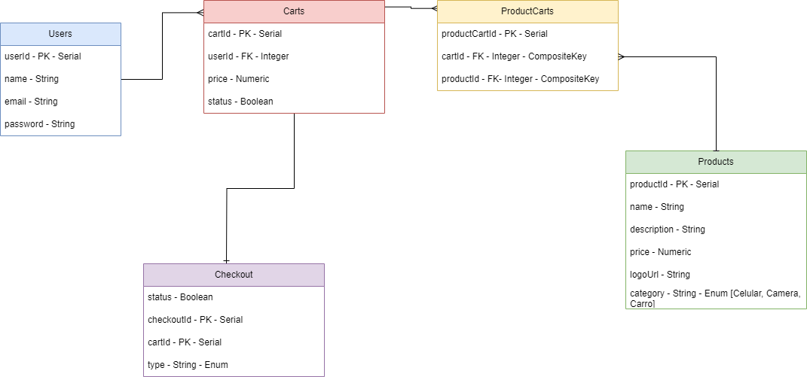

# M3S04 - Ex 01 a 07 criação de uma api para e-commerce
## Modelo utilizado na base de dados


## Iniciar o Projeto

Com o .env devidamente configurado:

primeiro instale as dependencias:
### `npm install`

depois migre o banco de dados:

### `npx sequelize-cli db:migrate`


Anotações:

para configurar novo migrate exemplo:
```sh
npx sequelize-cli migration:create --name create_carts_table
```
